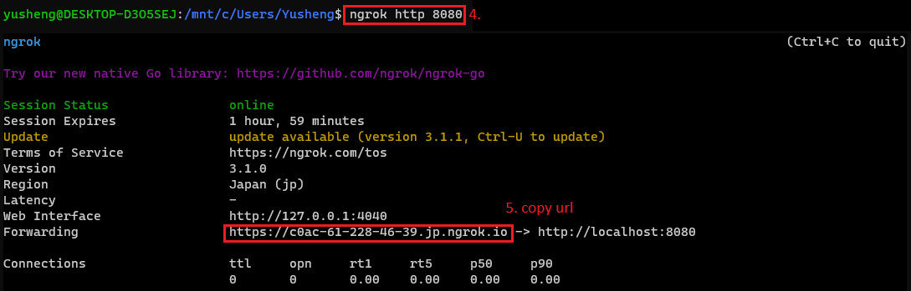

## About The Project

golang linebot exercise 

### Installation
+ HTTP framework: https://github.com/gin-gonic/gin
+ Config: https://github.com/spf13/viper
+ Mongo driver: https://github.com/mongodb/mongo-go-driver
+ Line Bot SDK: https://github.com/line/line-bot-sdk-go
+ Wire: https://github.com/google/wire
+ gin-swagger: https://github.com/swaggo/gin-swagger

### Run 
1. clone
```
git clone git@github.com:yusheng-lin/golinebot.git
cd golinebot
```
2. make
```
make
```

3. ngrok
```
ngrok http 8080
```


4. set webhook


5. join the channel and key some message


6. check db table


7. swagger test push message


8. swagger fetch messages

